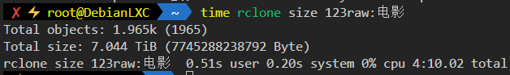
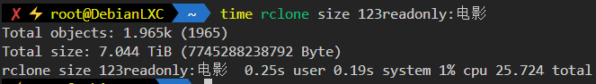

# 123PanList

## 能做什么

将123pan挂载为http服务，可用于rclone，alist等网盘程序

## 为什么要整这个

更快的遍历目录文件

官网webdav 4分10秒



官方api 25秒



[目录信息](data/tree.txt)
## 如何使用

前往[123云盘开放平台](https://www.123pan.com/developer)申请成为开发者，获取clientID与clientSecret

前往[123云盘三方挂载](https://www.123pan.com/thirdPartyMount) > WebDAV授权管理 > 添加应用 > 生成密码

执行
```
docker run -d --name=123panlist --restart=unless-stopped \
  -e CLIENT_ID=<你的clientID> \
  -e CLIENT_SECRET=<你的clientSecret> \
  -e WEBDAV_ACCOUNT='<webdav用户名>' \
  -e WEBDAV_SECRITE='<webdav密码>' \
  -e WEBDAV_HOST='<webdav服务器地址>'
  -p 8000:8000 
  riderlty/123panlist
```
使用Rclone等工具添加http后端即可


# 直接运行
```
pip install -r requirements.txt
```
在根目录创建以下三个文件并填入对应信息

WEBDAV_HOST

WEBDAV_SECRITE

WEBDAV_ACCOUNT

